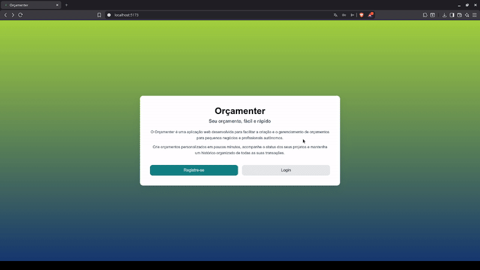

# 💰 ORCAMENTER

ORCAMENTER é uma aplicação web full-stack para criação e gerenciamento de orçamentos, construída com Django REST Framework no backend e React.js no frontend.

O sistema utiliza arquitetura desacoplada baseada em API REST, permitindo que o frontend consuma dados do backend de forma independente e escalável.

## 🌐 Aplicação em produção

https://orcamenter-front.onrender.com/

## 🖥️ Demonstração



## 🎯 Sobre o Projeto

Este projeto foi desenvolvido com foco em:

construção de APIs REST profissionais

integração React + Django

arquitetura frontend/backend desacoplada

deploy de aplicações full-stack

organização de código escalável

A aplicação permite que usuários criem, consultem, atualizem e removam orçamentos através de uma interface web moderna.

## 🚀 Funcionalidades

✔ Criar novos orçamentos
✔ Listar todos os orçamentos cadastrados
✔ Atualizar informações de um orçamento
✔ Excluir orçamentos
✔ Consumo de API REST
✔ Interface web responsiva
✔ Arquitetura desacoplada

## 🧱 Arquitetura do Sistema

O projeto segue o padrão client-server com separação clara entre frontend e backend.

```
Frontend (React)
│
│ HTTP Requests (JSON)
▼
REST API (Django REST Framework)
│
▼
Database
```

**Backend**

Responsável por:

- lógica de negócio

- persistência de dados

- endpoints REST

- serialização de dados

- controle de requisições

**Frontend**

- Responsável por:

- renderização da interface

- consumo da API

- gerenciamento de estado

- interação com usuário

## 🛠 Stack Tecnológica

### Backend

- Python

- Django

- Django REST Framework

- SQLite / PostgreSQL

- API REST

### Frontend

- React.js

- JavaScript (ES6+)

- HTML5

- CSS3

### Infraestrutura

- Render (Deploy)

- GitHub (Versionamento)

## 📡 API Endpoints

| Método | Endpoint         | Descrição                 |
| ------ | ---------------- | ------------------------- |
| GET    | /orcamentos      | Lista todos os orçamentos |
| POST   | /orcamentos      | Cria um novo orçamento    |
| PUT    | /orcamentos/{id} | Atualiza um orçamento     |
| DELETE | /orcamentos/{id} | Remove um orçamento       |

## 📂 Estrutura do Projeto

```
ORCAMENTER
│
├── backend
│ │
│ ├── api
│ │ ├── models
│ │ ├── serializers
│ │ ├── views
│ │ └── urls
│ │
│ └── manage.py
│
├── frontend
│ │
│ ├── src
│ │ ├── components
│ │ ├── pages
│ │ └── services
│
└── README.md
```

## ⚙️ Instalação Local

### 1️⃣ Clonar o repositório

git clone https://github.com/jdelta22/ORCAMENTER.git
cd ORCAMENTER

### 🔧 Configuração do Backend

<details>
<summary>Ver mais</summary>

#### Criar ambiente virtual

`python -m venv venv`

#### Ativar ambiente

**Linux / Mac**

`source venv/bin/activate`

**Windows**

`venv\Scripts\activate`

#### Instalar dependências

`pip install -r requirements.txt`

#### Executar migrações

`python manage.py migrate`

#### Iniciar servidor

`python manage.py runserver`

#### API disponível em

http://127.0.0.1:8000

</details>

### 🎨 Configuração do Frontend

<details>
<summary>Ver mais</summary>

#### Entrar na pasta do frontend

`cd frontend`

#### Instalar dependências

`npm install`

#### Executar aplicação

`npm start`

#### Aplicação disponível em

http://localhost:3000

</details>

### 🌍 Deploy

A aplicação foi publicada utilizando Render, que permite deploy automático integrado ao GitHub.

Frontend em produção:

https://orcamenter-front.onrender.com/

## 📚 Aprendizados com o Projeto

Durante o desenvolvimento deste projeto foram praticados conceitos como:

- construção de APIs REST escaláveis

- serializers e viewsets no Django REST Framework

- integração React consumindo APIs

- organização de projetos full-stack

- deploy de aplicações web

## 👨‍💻 Autor

## João Pedro Calaça Costa

**GitHub**
https://github.com/jdelta22

**Linkedin**
https://www.linkedin.com/in/joaopedrocalaca/
